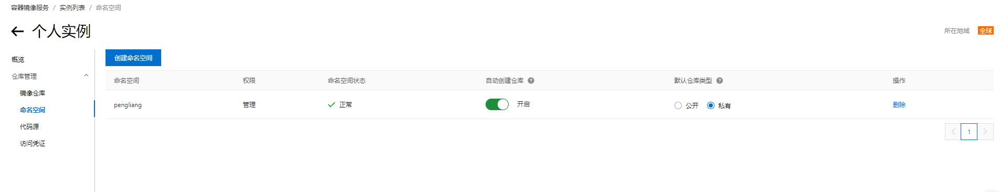
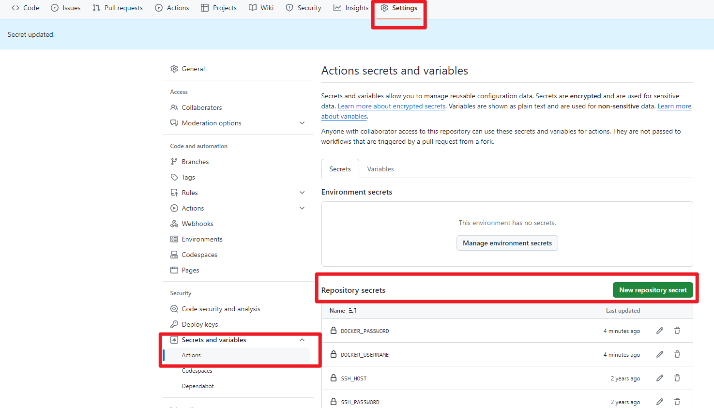

### 影响
`Docker Hub` 是目前最大的容器镜像社区,很久之前就经常说可能用不了，这会是真的访问不到了。。
我的一些项目是通过`github action`打包镜像推动到`Docker Hub`，然后服务器去拉取镜像，并构建。

### 大善人阿里云的个人版私有仓库
类似于npm的淘宝代理，我们也可以把仓库存在阿里云这，拉也从阿里云拉。

#### 第一步：登录阿里云，新建命名空间

[https://cr.console.aliyun.com/cn-hangzhou/instance/namespaces](https://cr.console.aliyun.com/cn-hangzhou/instance/namespaces)




然后就可以了，`镜像仓库`由 docker命令生成，并推送。

#### 修改.github\workflows\schedule.yml

将原来默认的官方源，修改成阿里云的源

```yml
name: CI/CD
# 触发条件为 push
on: [push] # 执行时机
# 任务
jobs:
  test:
    # 运行的环境
    runs-on: ubuntu-latest
    # 步骤
    steps:
      - uses: actions/checkout@v2 # git pull
      - name: Use Node.js
        uses: actions/setup-node@v1
        with:
          node-version: 14
      - name: 打包镜像, 上传 Docker Hub
        # 由于我只需要一个版本所以：镜像仓库名=镜像名，大家可以根据自己需求来
        # DOCKER_USERNAME 就是阿里云账号名，DOCKER_PASSWORD就是新建命名空间的时候设置的密码。
        run: |
          docker login --username=${{ secrets.DOCKER_USERNAME }} --password=${{ secrets.DOCKER_PASSWORD }} registry.cn-hangzhou.aliyuncs.com
          docker build -t 镜像仓库名  .
          docker tag 镜像仓库名 registry.cn-hangzhou.aliyuncs.com/pengliang/镜像仓库名
          docker push registry.cn-hangzhou.aliyuncs.com/pengliang/镜像仓库名:latest

      - name: 登录服务器, 执行脚本
        uses: appleboy/ssh-action@master
        with:
          host: ${{ secrets.SSH_HOST }}
          username: ${{ secrets.SSH_USERNAME }}
          password: ${{ secrets.SSH_PASSWORD }}
          script: |
            docker stop resume
            docker rm resume
            docker rmi registry.cn-hangzhou.aliyuncs.com/pengliang/镜像仓库名:latest
          docker login --username=${{ secrets.DOCKER_USERNAME }} --password=${{ secrets.DOCKER_PASSWORD }} registry.cn-hangzhou.aliyuncs.com
            docker pull registry.cn-hangzhou.aliyuncs.com/pengliang/镜像仓库名:latest
            docker run --restart=always -d -p 10002:80 --name resume registry.cn-hangzhou.aliyuncs.com/pengliang/镜像仓库名:latest
```

`secrets.xxx`·` 等变量在github项目中配置


